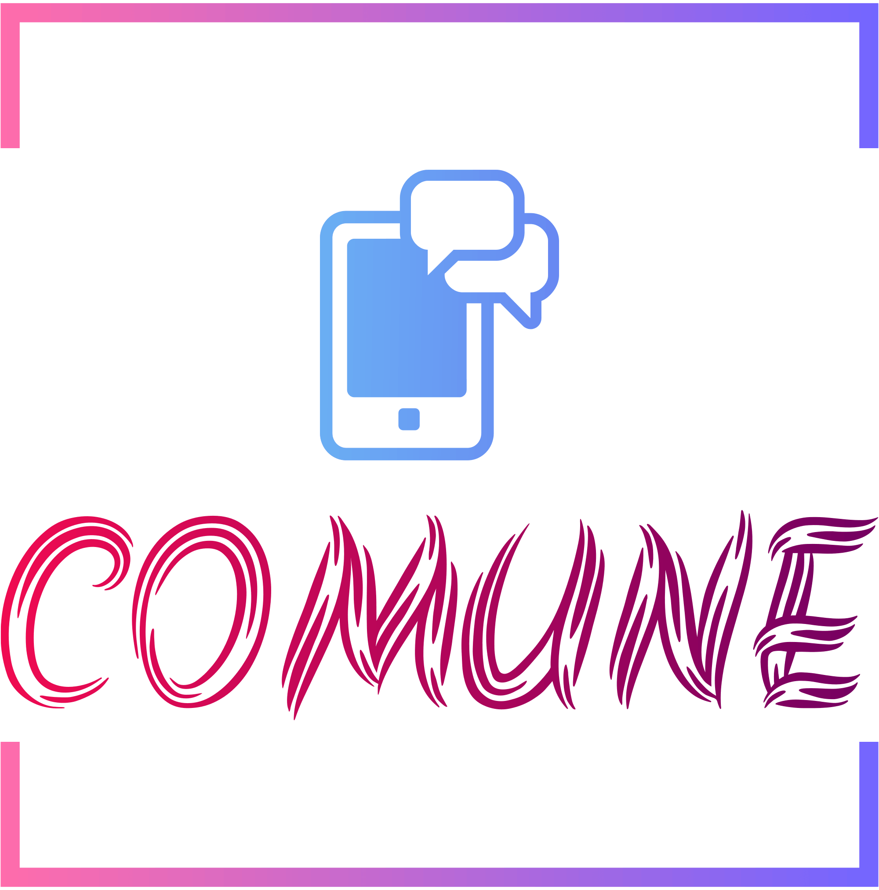

<a id="readme-top"></a>


<!-- PROJECT LOGO -->
<br />
<div align="center">
  <a href="https://github.com/krishujeniya/COMUNE-The-Chatting-App">
    
  </a>

  <h3 align="center">COMUNE - The Chatting App</h3>

  <p align="center">
    A modern and efficient chatting application for seamless communication.
    <br />
    <a href="https://github.com/krishujeniya/COMUNE-The-Chatting-App"><strong>Explore the docs »</strong></a>
    <br />
    <br />
    <a href="https://github.com/krishujeniya/COMUNE-The-Chatting-App">View Demo</a>
    ·
    <a href="https://github.com/krishujeniya/COMUNE-The-Chatting-App/issues">Report Bug</a>
    ·
    <a href="https://github.com/krishujeniya/COMUNE-The-Chatting-App/issues">Request Feature</a>
  </p>
</div>

<!-- TABLE OF CONTENTS -->
<details>
  <summary>Table of Contents</summary>
  <ol>
    <li>
      <a href="#about-the-project">About The Project</a>
      <ul>
        <li><a href="#key-features">Key Features</a></li>
      </ul>
    </li>
    <li>
      <a href="#built-with">Built With</a>
    </li>
    <li>
      <a href="#getting-started">Getting Started</a>
      <ul>
        <li><a href="#prerequisites">Prerequisites</a></li>
        <li><a href="#installation">Installation</a></li>
      </ul>
    </li>
    <li><a href="#license">License</a></li>
    <li><a href="#acknowledgments">Acknowledgments</a></li>
  </ol>
</details>

<!-- ABOUT THE PROJECT -->
## About The Project

COMUNE is a feature-rich chatting application designed to facilitate seamless communication between users in real-time.

### Key Features

- **Real-time Messaging**
- **User Authentication and Profile Management**
- **Media and File Sharing**
- **Group Chat Functionality**
- **Message Encryption**
- **Search Functionality**

## Built With

- [](https://dart.dev/)
- [](https://flutter.dev/)

<!-- GETTING STARTED -->
## Getting Started

To get a local copy up and running, follow these steps.

### Prerequisites

- **Dart**: Ensure you have the latest version of Dart installed. [Dart Installation Guide](https://dart.dev/get-dart)
- **Flutter**: Ensure you have the latest version of Flutter installed. [Flutter Installation Guide](https://flutter.dev/docs/get-started/install)

### Installation

1. Clone the repo
   ```sh
   git clone https://github.com/krishujeniya/COMUNE-The-Chatting-App.git
   cd COMUNE-The-Chatting-App
   ```
2. Install dependencies
   ```sh
   flutter pub get
   ```
3. Run the app
   ```sh
   flutter run
   ```

<!-- LICENSE -->
## License

Distributed under the MIT License. See `LICENSE.txt` for more information.

<!-- ACKNOWLEDGMENTS -->
## Acknowledgments

- [Dart](https://dart.dev/)
- [Flutter](https://flutter.dev/)
- [Open Source Community](https://opensource.org/)
- [Contributors](https://github.com/krishujeniya/COMUNE-The-Chatting-App/graphs/contributors)
